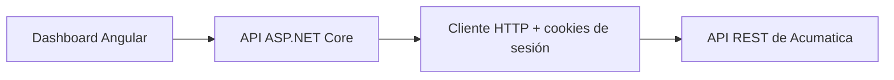

<p align="right">
  <a href="./README.md">English</a> · <a href="./README.es.md">Español</a>
</p>

# ClandBus · Evaluación técnica de la API de Acumatica


Prueba de concepto full-stack creada como **evaluación técnica** para explorar la API REST de Acumatica y presentar datos de órdenes de venta en un dashboard operativo. El proyecto demuestra el flujo completo de integración; no se presenta como una plataforma productiva.

## Qué demuestra

- Autenticación en tiempo de ejecución contra una instancia de Acumatica.
- Manejo de cookies de sesión ERP mediante una API intermediaria en ASP.NET Core.
- Consulta de órdenes de venta y métricas de dashboard.
- Búsqueda, filtros por estado y control de registros visibles.
- Actualización de descripciones y ejecución de `Remove Hold`.
- Estados de carga, notificaciones, interfaz responsiva y cierre explícito de sesión.
- Separación entre el cliente Angular y la comunicación específica con el ERP.

## Arquitectura



El navegador no consume Acumatica directamente. El backend encapsula la autenticación, las cookies, los endpoints ERP, el mapeo de respuestas y los límites de error.

## Tecnologías

| Capa | Tecnología |
| --- | --- |
| Frontend | Angular 20, TypeScript, SCSS, componentes standalone, HttpClient |
| Backend | ASP.NET Core 8, C#, inyección de dependencias, HttpClient, CookieContainer |
| Integración | API REST de Acumatica, endpoint Default `24.200.001` |

## API interna

| Método | Ruta | Propósito |
| --- | --- | --- |
| `POST` | `/api/Acumatica/login` | Iniciar la sesión ERP con credenciales ingresadas en ejecución |
| `GET` | `/api/Acumatica/orders` | Consultar órdenes de venta |
| `POST` | `/api/Acumatica/update-order` | Actualizar la descripción de una orden |
| `POST` | `/api/Acumatica/remove-hold` | Quitar la retención de una orden |
| `POST` | `/api/Acumatica/logout` | Cerrar la sesión ERP |
| `GET` | `/api/Health` | Verificar la disponibilidad de la API |

## Ejecución local

### 1. Configurar el backend

```powershell
cd backend/ClandbusERPIntegration/ClandbusERPIntegration
Copy-Item appsettings.Development.example.json appsettings.Development.json
```

Configura `Acumatica:BaseUrl` con una instancia de pruebas. El archivo resultante queda ignorado por Git. También puedes usar [secretos de usuario de .NET](https://learn.microsoft.com/aspnet/core/security/app-secrets).

### 2. Iniciar la API

```powershell
dotnet restore
dotnet run
```

El perfil de desarrollo publica Swagger para consultar los endpoints locales.

### 3. Iniciar Angular

```powershell
cd frontend/clandbus-dashboard
npm ci
npm start
```

Abre `http://localhost:4200`. Actualmente el frontend espera la API en `https://localhost:7004/api/Acumatica`.

## Seguridad y alcance

- Las credenciales no deben almacenarse en el repositorio; se ingresan durante la ejecución.
- Los payloads de acceso y las respuestas ERP no se escriben en los logs.
- La validación de certificados HTTPS permanece habilitada.
- Debe utilizarse un tenant de pruebas y una cuenta con privilegios mínimos.
- La sesión ERP en memoria está pensada para una **demostración de un solo usuario**. Una versión multiusuario necesitaría aislamiento de sesiones, autenticación/autorización de la aplicación, gestión centralizada de secretos, auditoría, rate limiting y pruebas de integración en un entorno controlado.
- Existió una configuración de desarrollo en el historial de Git. Si alguna vez contuvo credenciales reales, deben rotarse; borrar el archivo actual no elimina el historial.

Consulta [SECURITY.md](./SECURITY.md) para conocer las reglas y brechas pendientes antes de un uso productivo.

## Validación

Ambas aplicaciones pueden compilarse sin una conexión ERP:

```powershell
dotnet build backend/ClandbusERPIntegration/ClandbusERPIntegration.sln
npm --prefix frontend/clandbus-dashboard run build
```

El flujo ERP de extremo a extremo requiere una instancia de pruebas autorizada y no puede reproducirse con credenciales públicas.

## Autor

Desarrollado por [Javier Solís](https://github.com/Polar2565) como evaluación técnica y caso de estudio de portafolio.

Acumatica es una marca de su respectivo propietario. Este proyecto independiente no es un producto oficial de Acumatica.
