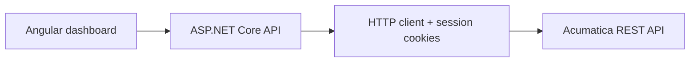

<p align="right">
  <a href="./README.md">English</a> · <a href="./README.es.md">Español</a>
</p>

# ClandBus · Acumatica API Technical Assessment


A full-stack proof of concept created as a **technical assessment** to explore the Acumatica REST API and present sales-order data in an operational dashboard. The project demonstrates the integration flow end to end; it is not presented as a production platform.

## What it demonstrates

- Runtime authentication against an Acumatica instance.
- ERP session-cookie handling through an ASP.NET Core intermediary API.
- Sales-order retrieval and dashboard metrics.
- Search, status filters, and configurable visible rows.
- Description updates and the `Remove Hold` action.
- Loading states, feedback notifications, responsive UI, and explicit logout.
- Separation between the Angular client and ERP-specific communication.

## Architecture



The browser never calls Acumatica directly. The backend encapsulates authentication, cookies, ERP endpoints, response mapping, and error boundaries.

## Technology

| Layer | Technology |
| --- | --- |
| Frontend | Angular 20, TypeScript, SCSS, standalone components, HttpClient |
| Backend | ASP.NET Core 8, C#, dependency injection, HttpClient, CookieContainer |
| Integration | Acumatica REST API, Default endpoint `24.200.001` |

## Internal API

| Method | Route | Purpose |
| --- | --- | --- |
| `POST` | `/api/Acumatica/login` | Start the ERP session with credentials supplied at runtime |
| `GET` | `/api/Acumatica/orders` | Retrieve sales orders |
| `POST` | `/api/Acumatica/update-order` | Update an order description |
| `POST` | `/api/Acumatica/remove-hold` | Remove an order hold |
| `POST` | `/api/Acumatica/logout` | Close the ERP session |
| `GET` | `/api/Health` | Check API availability |

## Run locally

### 1. Configure the backend

Copy the example file and replace only the local value:

```powershell
cd backend/ClandbusERPIntegration/ClandbusERPIntegration
Copy-Item appsettings.Development.example.json appsettings.Development.json
```

Set `Acumatica:BaseUrl` to a test instance. Keep the resulting development file untracked. You may use [.NET user secrets](https://learn.microsoft.com/aspnet/core/security/app-secrets) instead.

### 2. Start the API

```powershell
dotnet restore
dotnet run
```

The launch profile exposes the local API documented by Swagger in Development.

### 3. Start the Angular client

```powershell
cd frontend/clandbus-dashboard
npm ci
npm start
```

Open `http://localhost:4200`. The frontend currently expects the API at `https://localhost:7004/api/Acumatica`.

## Security and scope

- No credentials belong in source control; ERP credentials are entered at runtime.
- Sensitive login payloads and ERP responses are not written to application logs.
- HTTPS certificate validation remains enabled.
- Use a dedicated test tenant and least-privilege account.
- The current in-memory ERP session is intended for a **single-user demonstration**. A multi-user release would require per-user session isolation, application authentication/authorization, centralized secret management, auditing, rate limiting, and integration tests against a controlled environment.
- A previous development configuration existed in Git history. If any real credential was ever used there, it must be rotated; deleting the current file does not erase repository history.

See [SECURITY.md](./SECURITY.md) for the handling rules and production gaps.

## Validation

The repository can be validated without an ERP connection by building both applications:

```powershell
dotnet build backend/ClandbusERPIntegration/ClandbusERPIntegration.sln
npm --prefix frontend/clandbus-dashboard run build
```

End-to-end ERP behavior requires an authorized Acumatica test instance and cannot be reproduced with public credentials.

## Author

Developed by [Javier Solís](https://github.com/Polar2565) as a technical assessment and portfolio case study.

Acumatica is a trademark of its respective owner. This independent project is not an official Acumatica product.
